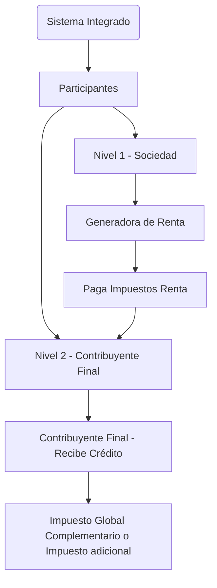
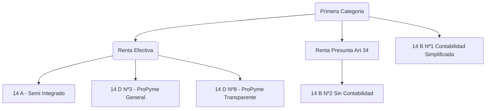

# Tributaria

## 1. Sistema Integrado

El **sistema integrado** consiste en que dos participante en el ciclo del pago de impuesto de las utilidades que reciba este ya sea por generación de servicios o productos que ofrezca en periodo anual, en este caso el impuesto generado por la empresa de Nivel 1 pasa a ser un crédito para el contribuyente final(*socios o dueños*) de nivel 2 que consumira este saldo a favor suyo para el pago del los **Impuesto Global Complementario** y en el caso de tener nacionalidad extranjera sera **Impuesto adicional**.

### 1.1. Regímenes Tributarios

A partir de Enero 2020 hacia delante existen 4 tipos de regimenes tributarios

